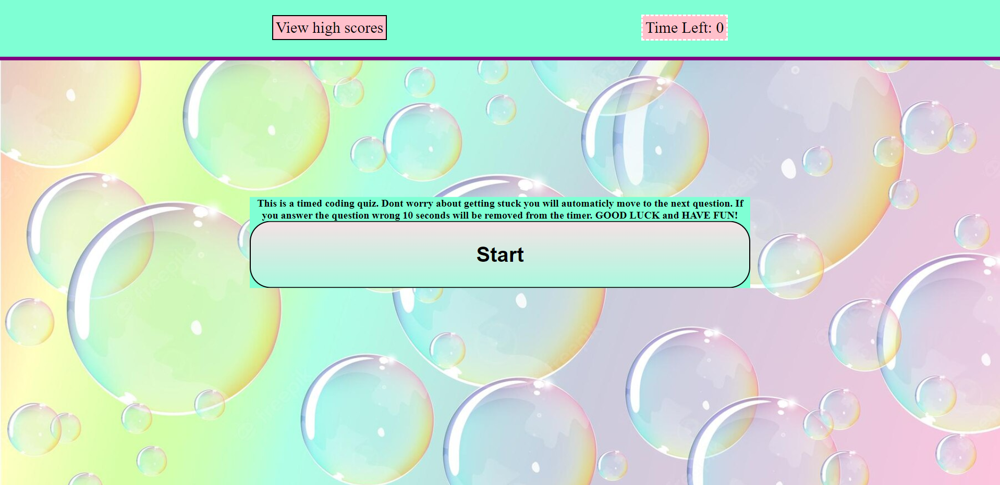

# Coding Quiz

# Description
- This timed quiz created using HTML/CSS/JAVASCRIPT

- The quiz is multiple choice and will ask you questions about basic coding 

- I built this quiz as part of a requirment to obtain my fullstack developer certification and also as a display of my work for future employers 

# Installation
- No installation required. You can take the quiz in your browser

# Usage
- Press start to initiate the quiz, answer all the questions the best you can. If you answer a question wrong 10 seconds will be subtracted from the quiz timer. Dont worry the next question will be displayed and just keep trying. If you run out of time you be shown a message that will ask if you would like to try again or return to the start screen. Click the try again button and the quiz will restart. If you finsih the quiz whatever time remaining you have will be your score, enter your intials and press enter to save your score. If you would like to see your scores click on the "View High Scores" button on the top left and all stored scores will be displayed. If you would like to remove the scores, click the remove scores button.  

- Note that if the time hits zero you will not be able to save your score, i think we all know a score of zero is not worth saving, but you will be prompted to try again.

You can view and take this quiz at (https://sspenelope.github.io/Coding-Quiz/?)

# Credits
- Myself for the creation of this quiz

- All of the wonderful developers who were willing to put their snippets and solutions on stackoverflow for other junior developers like myself who get stuck or might not understand how to add something.

- GeeksForGeeks, for showing me how  to create an array of objects, with arrays within the objects

- The wonderful creators of W3Schools for all the tips, tricks and useful information when it comes to anything coding related

- All the assisants at askBCS that helped me work through tough errors I ran into, without your help this would have been alot more difficult

- UofM Coding bootcamp for the base requirements of what this project needed to include

